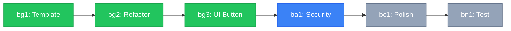

# Task Artifact UX Design Guide

**Version:** 1.0.0  
**Created:** 2026-01-06  
**Author:** Claude (Voice of Polish)  
**Purpose:** Best practices for designing task.md artifacts that maximize clarity, scannability, and execution velocity.

---

## Philosophy

> **Core Principle:** A task artifact should answer "What do I do next?" in under 3 seconds.

Task artifacts are operational documents, not reference manuals. They must:

- **Minimize cognitive load** for the executing voice
- **Maximize scannability** for quick status checks
- **Prevent errors** through clear boundaries and stop conditions
- **Enable flow** by removing friction from task execution

---

## Current State Analysis

### ✅ What Works Well

1. **Clear Role Segmentation** - "For [Voice]" sections make ownership unambiguous
2. **Status Indicators** - Visual emoji status (✅ DONE, 🔵 READY, ⏸️ BLOCKED) is scannable
3. **DO/DO NOT Structure** - Explicit boundaries prevent scope creep
4. **Handoff Chain** - Clear dependency flow between tasks
5. **Protocol Header** - Quick reference for document usage

### ❌ Current Pain Points

1. **Dense Text Blocks** - Hard to scan when looking for "what's next?"
2. **No Progress Overview** - Can't see sprint status at a glance
3. **Long File Paths** - Break reading flow and reduce clarity
4. **Hidden Stop Conditions** - Easy to miss critical escalation triggers
5. **No Quick Action Summary** - Requires reading entire document to find next task
6. **Buried Context** - Important details lost in walls of text

---

## UX Improvement Patterns

### Pattern 1: Quick Action Summary

**Problem:** Voices must read entire document to find their next task.

**Solution:** Add actionable summary at the top.

```markdown
## 🚀 Ready to Execute

| Task                      | Owner  | Action           |
| ------------------------- | ------ | ---------------- |
| [ba1] XSS/Injection Audit | Ana    | 🔵 **START NOW** |
| [bg4] Add Loading States  | Gemini | 🔵 **START NOW** |

**Blocked Tasks:** bc1 (waiting for ba1), bn1 (waiting for bc1)  
**Completed:** bg1, bg2, bg3 ✅
```

**Benefits:**

- Zero cognitive load to find next action
- Clear accountability
- Reduces context switching
- Motivates by showing progress

**Implementation Priority:** 🔥 **P0** (High Impact, Low Effort)

---

### Pattern 2: Progress Visualization

**Problem:** No quick way to see overall sprint progress and dependencies.

**Solution:** Add Mermaid diagram showing task pipeline.

````markdown
## 📊 Sprint Progress


````

````

**Benefits:**
- Instant visual understanding of pipeline state
- Shows dependencies clearly
- Identifies bottlenecks
- Motivating to see progress

**Implementation Priority:** ⚡ **P1** (Medium Impact, Medium Effort)

---

### Pattern 3: Collapsible Task Details

**Problem:** Task blocks are dense and create visual clutter.

**Solution:** Use HTML details/summary for progressive disclosure.

**Before:**
```markdown
### [bg1] Create Viewer Template

- **Status:** ✅ DONE
- **Context:** Current state: `publishUtils.js` has hardcoded HTML template.
- **Goal:** Extract and create premium viewer template.

#### DO

- [ ] `C:\\Users\\evanj\\OneDrive\\Desktop\\CevicheBar\\src\\utils\\viewerTemplate.js` — Create new file
- [ ] Port design tokens from `C:\\Users\\evanj\\OneDrive\\Desktop\\CevicheBar\\src\\index.css`
- [ ] Add glassmorphism, transitions, responsive grid

#### DO NOT

- ❌ Modify `publishUtils.js` yet (that's bg2)
- ❌ Use external CSS files (must be self-contained)

**Output:** `viewerTemplate.js` exporting `generateViewerHTML(data)`
**Stop Condition:** If CSS complexity exceeds 200 lines, escalate to Claude
**Handoff:** → bg2
````

**After:**

```markdown
### [bg1] Create Viewer Template

**Status:** ✅ DONE (3/3) | **Owner:** Gemini | **Handoff:** → bg2  
**Goal:** Extract and create premium viewer template.

<details>
<summary>📋 Task Details</summary>

#### DO

- [x] Create [viewerTemplate.js](file:///C:/Users/evanj/OneDrive/Desktop/CevicheBar/src/utils/viewerTemplate.js)
- [x] Port design tokens from [index.css](file:///C:/Users/evanj/OneDrive/Desktop/CevicheBar/src/index.css)
- [x] Add glassmorphism, transitions, responsive grid

#### DO NOT

- ❌ Modify `publishUtils.js` yet (that's bg2)
- ❌ Use external CSS files (must be self-contained)

> [!CAUTION] > **Stop Condition:** If CSS complexity exceeds 200 lines, escalate to Claude

**Output:** `viewerTemplate.js` exporting `generateViewerHTML(data)`

</details>
```

**Benefits:**

- Status, owner, and handoff visible at a glance
- Collapsible details reduce visual clutter
- Easier to scan for "what's my next task?"
- Completed tasks can be collapsed to reduce noise

**Implementation Priority:** ⚡ **P1** (Medium Impact, Low Effort)

---

### Pattern 4: Enhanced Context Links

**Problem:** Long file paths break reading flow and reduce clarity.

**Solution:** Use markdown links with readable labels.

**Before:**

```markdown
- [ ] `C:\\Users\\evanj\\OneDrive\\Desktop\\CevicheBar\\src\\utils\\viewerTemplate.js` — Create new file
- [ ] Port design tokens from `C:\\Users\\evanj\\OneDrive\\Desktop\\CevicheBar\\src\\index.css`
```

**After:**

```markdown
- [ ] Create [viewerTemplate.js](file:///C:/Users/evanj/OneDrive/Desktop/CevicheBar/src/utils/viewerTemplate.js)
- [ ] Port design tokens from [index.css](file:///C:/Users/evanj/OneDrive/Desktop/CevicheBar/src/index.css)
```

**Benefits:**

- Cleaner, more readable
- Clickable links for quick navigation
- Focuses on action, not path
- Reduces visual noise by 60%+

**Implementation Priority:** 🔥 **P0** (High Impact, Low Effort)

---

### Pattern 5: Blocked Task Clarity

**Problem:** Blocked tasks don't clearly show what they're waiting for.

**Solution:** Explicit dependency and ETA information.

**Before:**

```markdown
### [bc1] Premium Viewer Styling

- **Status:** ⏸️ BLOCKED (by ba1)
- **Context:** Viewer needs visual polish to match main app
- **Goal:** Achieve premium aesthetic in generated HTML.
```

**After:**

```markdown
### [bc1] Premium Viewer Styling

**Status:** ⏸️ BLOCKED | **Owner:** Claude  
**Waiting For:** [ba1] XSS/Injection Audit ✅ Sign-off  
**ETA:** When Ana completes security review  
**Goal:** Achieve premium aesthetic in generated HTML.

<details>
<summary>📋 Task Details</summary>

...

</details>
```

**Benefits:**

- Explicit dependency chain
- Sets expectations
- Easier to unblock when dependency clears
- Reduces "why am I blocked?" questions

**Implementation Priority:** 💡 **P2** (Low Impact, Low Effort)

---

### Pattern 6: Prominent Stop Conditions

**Problem:** Stop conditions are buried in text and easy to miss.

**Solution:** Use GitHub alert styling for critical conditions.

**Before:**

```markdown
**Stop Condition:** If CSS complexity exceeds 200 lines, escalate to Claude
```

**After:**

```markdown
> [!CAUTION] > **Stop Condition:** If CSS complexity exceeds 200 lines, escalate to Claude
```

**Benefits:**

- Uses GitHub alert styling (red background)
- Impossible to miss
- Prevents wasted work
- Clear escalation triggers

**Implementation Priority:** 🔥 **P0** (High Impact, Low Effort)

---

### Pattern 7: Completion Tracking

**Problem:** No way to track sub-task progress within a task block.

**Solution:** Add completion counters and timestamps.

**Before:**

```markdown
### [bg1] Create Viewer Template

- **Status:** ✅ DONE
```

**After:**

```markdown
### [bg1] Create Viewer Template

**Status:** ✅ DONE (3/3 tasks) | **Completed:** 2026-01-06T14:30
```

**Benefits:**

- Shows sub-task progress
- Timestamp provides audit trail
- Clearer definition of "done"
- Helps identify stuck tasks

**Implementation Priority:** 💡 **P2** (Low Impact, Low Effort)

---

## Recommended Template Structure

```markdown
# 🎯 Active Orders — [Project] [Version]

**Sprint:** [Sprint Name]
**Phase:** [1-7] ([PHASE NAME])
**Last Updated:** [ISO Timestamp] by [Voice]

---

> **PROTOCOL:**
>
> 1. Check "Ready to Execute" for your next task
> 2. Execute using context links
> 3. Blocked? Mark as `⏸️ BLOCKED` and notify Commander
> 4. Done? Update status to `✅ DONE` and log in `COMPLETION_LOG.md`

---

## 🚀 Ready to Execute

| Task            | Owner | Action           |
| --------------- | ----- | ---------------- |
| [xx1] Task Name | Voice | 🔵 **START NOW** |

**Blocked Tasks:** [List with reasons]
**Completed:** [List] ✅

---

## 📊 Sprint Progress

[Mermaid diagram showing task pipeline]

---

## 🔨 For [Voice] (Role)

### [code] Task Name

**Status:** [Emoji] [STATUS] [(X/Y tasks)] | **Owner:** [Voice] | **Handoff:** → [next]
**Goal:** [One-line goal statement]

<details>
<summary>📋 Task Details</summary>

#### DO

- [ ] Action with [linked file](file:///)
- [ ] Another action

#### DO NOT

- ❌ Boundary condition
- ❌ Another boundary

> [!CAUTION] > **Stop Condition:** [Escalation trigger]

**Output:** [Expected deliverable]

</details>

---

[Repeat for each voice section]

---

_Vanguard Class — Active Orders [Version]_
```

---

## Implementation Checklist

When creating or updating task artifacts:

- [ ] Add Quick Action Summary at top
- [ ] Use enhanced context links (markdown, not raw paths)
- [ ] Wrap task details in collapsible sections
- [ ] Add progress visualization (if 5+ tasks)
- [ ] Use GitHub alerts for stop conditions
- [ ] Include completion tracking (X/Y tasks)
- [ ] Clarify blocked task dependencies
- [ ] Add status emoji to every task
- [ ] Include handoff chain
- [ ] Timestamp last update

---

## Priority Matrix

| Priority | Improvement               | Impact    | Effort | ROI        |
| -------- | ------------------------- | --------- | ------ | ---------- |
| **P0**   | Quick Action Summary      | 🔥 High   | Low    | ⭐⭐⭐⭐⭐ |
| **P0**   | Enhanced Context Links    | 🔥 High   | Low    | ⭐⭐⭐⭐⭐ |
| **P0**   | Prominent Stop Conditions | 🔥 High   | Low    | ⭐⭐⭐⭐⭐ |
| **P1**   | Progress Visualization    | ⚡ Medium | Medium | ⭐⭐⭐⭐   |
| **P1**   | Collapsible Details       | ⚡ Medium | Low    | ⭐⭐⭐⭐   |
| **P2**   | Blocked Task Clarity      | 💡 Low    | Low    | ⭐⭐⭐     |
| **P2**   | Completion Tracking       | 💡 Low    | Low    | ⭐⭐⭐     |

---

## Migration Strategy

### For Existing Projects

1. **Start with P0 items** - Quick wins with high impact
2. **Add Quick Action Summary** - 5 minutes, immediate value
3. **Convert file paths to links** - Find/replace operation
4. **Wrap stop conditions in alerts** - Critical safety improvement
5. **Add progress diagram** - Once P0 items are done
6. **Refactor to collapsible sections** - Gradual, as tasks update

### For New Projects

- Use recommended template from the start
- All P0-P2 patterns should be default
- Customize based on project complexity

---

## Examples

### Minimal (Simple Sprint, 3-5 tasks)

- Quick Action Summary ✅
- Enhanced Context Links ✅
- Prominent Stop Conditions ✅
- Skip: Progress diagram, collapsible sections

### Standard (Medium Sprint, 6-12 tasks)

- All P0 patterns ✅
- Progress Visualization ✅
- Collapsible Details ✅
- Optional: Completion tracking

### Complex (Large Sprint, 13+ tasks)

- All patterns (P0-P2) ✅
- Multiple progress diagrams (per voice) ✅
- Extensive use of collapsible sections ✅
- Completion tracking mandatory ✅

---

## Anti-Patterns to Avoid

❌ **Wall of Text** - No visual hierarchy, everything at same level
❌ **Hidden Context** - Important info buried in paragraphs
❌ **Ambiguous Status** - No clear "what's next?"
❌ **Raw File Paths** - Long paths that break reading flow
❌ **Missing Stop Conditions** - No escalation triggers
❌ **No Progress Indicators** - Can't see sprint health at a glance
❌ **Unclear Ownership** - Who does what?

---

## Metrics for Success

A well-designed task artifact should achieve:

- **Time to Next Action:** < 3 seconds
- **Scan to Status:** < 5 seconds
- **Context Switch Cost:** Minimal (all links clickable)
- **Error Rate:** Near zero (stop conditions visible)
- **Completion Velocity:** Faster (less friction)

---

## Maintenance

- **Update frequency:** After every task status change
- **Review cadence:** End of each sprint
- **Ownership:** Anti (Phase 4) creates, all voices update
- **Archive:** Move to `COMPLETION_LOG.md` when sprint done

---

## Related Documents

- [CHORUS_WORKFLOW_V2.md](file:///C:/Users/evanj/OneDrive/Desktop/VanguardPlaybook/docs/CHORUS_WORKFLOW_V2.md) - Full 7-phase workflow
- [ACTIVE_ORDERS_TEMPLATE.md](file:///C:/Users/evanj/OneDrive/Desktop/VanguardPlaybook/templates/ACTIVE_ORDERS_TEMPLATE.md) - Blank template
- [COMPLETION_LOG_TEMPLATE.md](file:///C:/Users/evanj/OneDrive/Desktop/VanguardPlaybook/templates/COMPLETION_LOG_TEMPLATE.md) - Completion logging

---

**Handoff to Opus:**

> This guide synthesizes UX best practices for task artifact design. Please review and integrate into Phase 2 (PLAN) protocols, ensuring Anti creates task artifacts using these patterns by default.
>
> **Key Decision:** Should P0 patterns be mandatory for all projects, or only recommended?

---

_Vanguard Class — UX Design Guide v1.0.0_
