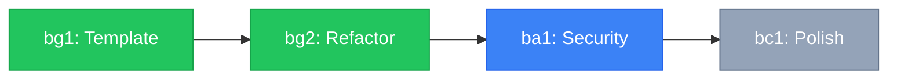

# Task Artifact Standards

# Vanguard Class — Central Command

**Purpose:** Mandatory UX standards for task artifacts. All ACTIVE_ORDERS documents must comply.
**Status:** Standard (Binding)
**Source:** TASK_ARTIFACT_UX_GUIDE.md (Claude, Voice of Polish)

---

## Core Principle

> **A task artifact should answer "What do I do next?" in under 3 seconds.**

---

## Mandatory Patterns (P0)

These patterns are **required** for all task artifacts.

### 1. Quick Action Summary

Every ACTIVE_ORDERS document must start with this section:

```markdown
## 🚀 Ready to Execute

| Task            | Owner | Action           |
| --------------- | ----- | ---------------- |
| [xx1] Task Name | Voice | 🔵 **START NOW** |

**Blocked Tasks:** [List with reasons]
**Completed:** [List] ✅
```

### 2. Enhanced Context Links

Use markdown links, not raw file paths:

```markdown
❌ `C:\Users\evanj\OneDrive\Desktop\CevicheBar\src\utils\viewerTemplate.js`
✅ [viewerTemplate.js](file:///C:/Users/evanj/OneDrive/Desktop/CevicheBar/src/utils/viewerTemplate.js)
```

### 3. Prominent Stop Conditions

Use GitHub alerts for escalation triggers:

```markdown
> [!CAUTION] > **Stop Condition:** If CSS complexity exceeds 200 lines, escalate to Claude
```

---

## Recommended Patterns (P1)

These patterns are **recommended** for sprints with 5+ tasks.

### 4. Progress Visualization

Include Mermaid diagram showing task pipeline:

````markdown

````

### 5. Collapsible Task Details

Use HTML details/summary for progressive disclosure:

```markdown
### [bg1] Create Viewer Template

**Status:** ✅ DONE (3/3) | **Owner:** Gemini | **Handoff:** → bg2
**Goal:** Extract and create premium viewer template.

<details>
<summary>📋 Task Details</summary>

#### DO

- [x] Create [viewerTemplate.js](file:///)
- [x] Port design tokens

#### DO NOT

- ❌ Boundary condition

</details>
```

---

## Optional Patterns (P2)

These patterns are **optional** but encouraged.

### 6. Blocked Task Clarity

Make dependencies explicit:

```markdown
**Waiting For:** [ba1] XSS/Injection Audit ✅ Sign-off
**ETA:** When Ana completes security review
```

### 7. Completion Tracking

Add counters and timestamps:

```markdown
**Status:** ✅ DONE (3/3 tasks) | **Completed:** 2026-01-06T14:30
```

---

## Anti-Patterns (Prohibited)

❌ **Wall of Text** — No visual hierarchy
❌ **Hidden Context** — Important info buried in paragraphs
❌ **Raw File Paths** — Long paths that break reading flow
❌ **Missing Stop Conditions** — No escalation triggers
❌ **Unclear Ownership** — Who does what?

---

## Metrics

A compliant task artifact achieves:

| Metric              | Target                              |
| :------------------ | :---------------------------------- |
| Time to Next Action | < 3 seconds                         |
| Scan to Status      | < 5 seconds                         |
| Context Switch Cost | Minimal (links clickable)           |
| Error Rate          | Near zero (stop conditions visible) |

---

## Ownership

- **Anti (Phase 4):** Creates artifacts using these standards
- **All Voices (Phase 5):** Update status as work completes
- **Opus (Phase 7):** Reviews for compliance violations

---

_Vanguard Class — Task Artifact Standards v1.0.0_
