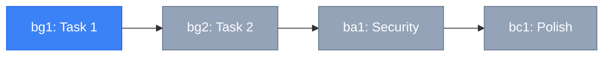

# 🎯 Active Orders — [Project Name] [Version]

**Sprint:** [Sprint Name] (e.g., v0.3.x Phase B)
**Phase:** 5 (EXECUTE)
**Last Updated:** [Date/Time] by [Voice]

---

> **PROTOCOL:**
>
> 1. Check "Ready to Execute" for your next task
> 2. Execute using context links
> 3. Blocked? Mark as `⏸️ BLOCKED` and notify Commander
> 4. Done? Update status to `✅ DONE` and log in `COMPLETION_LOG.md`

---

## 🚀 Ready to Execute

| Task            | Owner  | Action           |
| --------------- | ------ | ---------------- |
| [bg1] Task Name | Gemini | 🔵 **START NOW** |

**Blocked Tasks:** bc1 (waiting for ba1)
**Completed:** — ✅

---

## 📊 Sprint Progress

---

## 🔨 For Gemini (Builder)

### [bg1] [Task Name]

**Status:** 🔵 READY | **Owner:** Gemini | **Handoff:** → bg2
**Goal:** [One-line goal statement]

📋 Task Details

#### DO

- [ ] Create [filename.js](file:///absolute/path/to/file.js)
- [ ] Action with [linked file](file:///path)

#### DO NOT

- ❌ Boundary condition
- ❌ Another boundary

> [!CAUTION] > **Stop Condition:** [Escalation trigger]

**Output:** [Expected deliverable]

---

## 🛡️ For Ana (Security)

### [ba1] [Task Name]

**Status:** ⏸️ BLOCKED | **Owner:** Ana | **Handoff:** → bc1
**Waiting For:** [bg2] Task Name ✅ Completion
**Goal:** [One-line goal statement]

📋 Task Details

#### DO

- [ ] Audit [file.js](file:///path)

#### DO NOT

- ❌ Implement fixes (recommend only)

> [!CAUTION] > **Stop Condition:** If critical vulnerability found, BLOCK release

**Output:** Security sign-off or list of required fixes

---

## 🎨 For Claude (Polish)

### [bc1] [Task Name]

**Status:** ⏸️ BLOCKED | **Owner:** Claude | **Handoff:** → bn1
**Waiting For:** [ba1] Security Audit ✅ Sign-off
**Goal:** [One-line goal statement]

📋 Task Details

#### DO

- [ ] Review [component.jsx](file:///path)
- [ ] Add micro-animations, hover states

#### DO NOT

- ❌ Add JavaScript logic
- ❌ Change functional behavior

**Output:** Polished component

---

## ⚡ For Nova (Verification)

### [bn1] [Task Name]

**Status:** ⏸️ BLOCKED | **Owner:** Nova | **Handoff:** → Complete
**Waiting For:** [bc1] Polish ✅ Completion
**Goal:** [One-line goal statement]

📋 Task Details

#### DO

- [ ] Run verification checklist
- [ ] Test at mobile viewport
- [ ] Test print preview

#### DO NOT

- ❌ Make code changes

**Output:** ✅ Pass or ❌ Fail with specific issue

---

## 🗄️ For Anti (Oracle)

### [bx1] [Task Name]

**Status:** 🔵 READY | **Owner:** Anti
**Goal:** [One-line goal statement]

📋 Task Details

#### DO

- [ ] Update `CHORUS_STATE.md`
- [ ] Consolidate completion notes

**Output:** Updated state documentation

---

## Status Legend

| Emoji | Status      | Meaning                |
| :---- | :---------- | :--------------------- |
| 🔵    | READY       | Can start now          |
| ⏸️    | BLOCKED     | Waiting on dependency  |
| 🔄    | IN PROGRESS | Currently being worked |
| ✅    | DONE        | Completed and verified |

---

_Vanguard Class — Active Orders Template v2.0.0_
